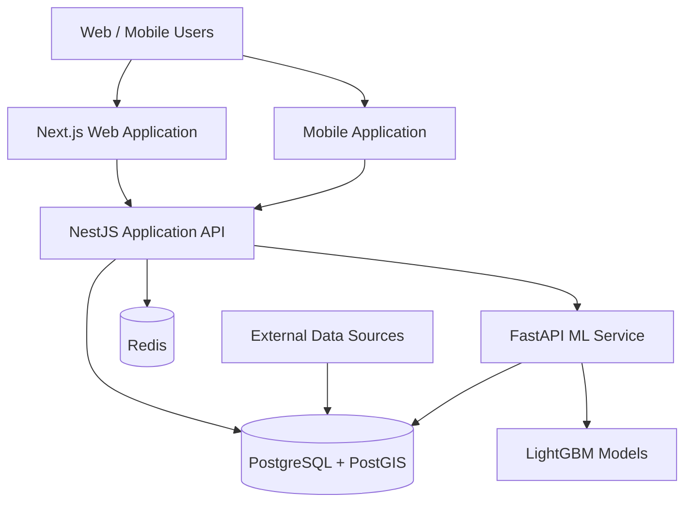
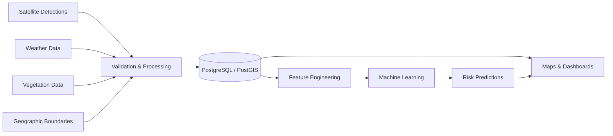
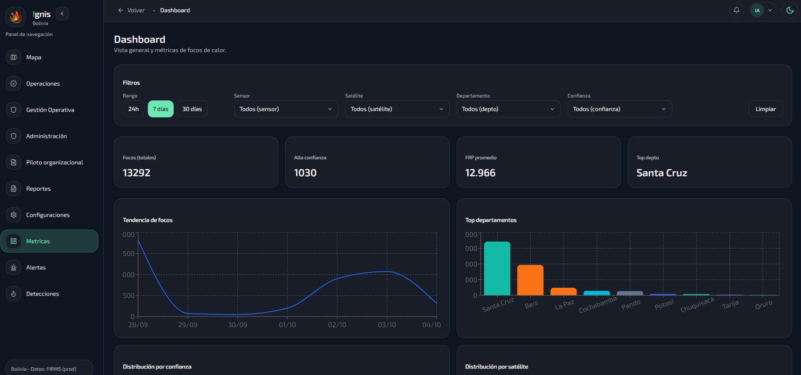

# IGNIS — Wildfire Monitoring & Risk Analysis Platform

Technical case study of a geospatial platform designed for wildfire monitoring, territorial analysis and fire-risk prediction in Bolivia.

> **Source code notice**
>
> This repository contains technical documentation, architecture and selected visual material only.
> The production source code is private and is not included in this repository.

---

## Overview

IGNIS is a web and mobile platform designed to support wildfire monitoring and territorial risk analysis.

The system combines satellite fire detections, geographic information, weather observations, vegetation indicators and predictive models to transform heterogeneous data into information that can be explored through maps, dashboards and risk analysis tools.

The platform covers the complete technical workflow:

- Data ingestion
- Geospatial processing
- Backend services
- Interactive visualization
- Automated processing
- User and role management
- Notifications
- Machine Learning inference
- Infrastructure and deployment

---

## The Problem

Wildfire monitoring involves much more than displaying detection points on a map.

A useful monitoring platform needs to answer questions such as:

- Where are active detections occurring?
- Which administrative or protected areas are affected?
- Are multiple detections related spatially?
- What environmental conditions are present?
- What has historically happened in that area?
- Which locations present higher estimated fire risk?

These questions require combining information from multiple sources with different structures, update cycles and spatial resolutions.

---

## My Role

My participation included work across several layers of the platform:

- Software architecture
- Backend development
- Frontend development
- Mobile integration
- Geospatial database design
- REST API design
- External data integrations
- Automated data processing
- Machine Learning integration
- Authentication and authorization
- Notification workflows
- Linux deployment and infrastructure
- Technical maintenance and system evolution

---

## Technology Stack

### Frontend

- Next.js
- React
- TypeScript
- Tailwind CSS
- MapLibre

### Backend

- NestJS
- TypeORM
- REST API
- OpenAPI

### Data

- PostgreSQL
- PostGIS
- Redis

### Machine Learning

- Python
- FastAPI
- SQLAlchemy
- LightGBM

### Infrastructure

- Linux
- Docker
- Nginx
- PM2
- Scheduled background services

---

## High-Level Architecture



The architecture separates application logic, data storage and Machine Learning workloads so that each component can evolve independently.

---

## Data Pipeline

The platform processes information coming from several types of sources:



Each source has its own update frequency and structure, so data must be normalized before it can be used consistently across the platform.

---

## Geospatial Architecture

One of the core components of the system is its geospatial database.

The platform works with:

- Satellite fire detections
- Administrative boundaries
- Protected areas
- Territorial analysis layers
- Weather observations
- Vegetation indicators
- Historical fire information
- A national analysis grid of approximately 46,000 geographic cells

PostGIS is used to perform spatial operations directly at database level.

Typical operations include:

```text
Detection → Municipality
Detection → Department
Detection → Protected Area
Detection → Analysis Cell
Prediction → Geographic Cell
```

This allows geographic relationships to remain part of the data model instead of being calculated manually inside the application layer.

---

## Engineering Decisions

### PostgreSQL + PostGIS

The platform relies heavily on spatial relationships.

Using PostGIS makes it possible to execute operations such as point-in-polygon queries, territorial intersections and proximity analysis directly inside the database.

This reduces the need to reproduce complex geographic logic in the backend.

---

### Separate Machine Learning Service

Machine Learning workloads were separated from the transactional backend.

The responsibilities are divided conceptually as follows:

```text
NestJS
│
├── Authentication
├── Users and roles
├── Incidents
├── Notifications
├── Monitoring
├── API
└── Business logic

FastAPI
│
├── Feature processing
├── Model inference
├── Prediction workflows
└── ML-related processing
```

This separation allows the application backend and the data-science stack to evolve independently.

---

### Automated Data Processing

Several external sources update at different intervals.

Manual execution would make the platform difficult to maintain, so automated processes were introduced for:

- Satellite data ingestion
- Weather synchronization
- Vegetation updates
- Historical data processing
- Prediction generation
- Data retention
- Cleanup tasks

The goal is for the platform to continue processing information without requiring constant manual intervention.

---

## From Monitoring to Prediction

The platform initially answers a monitoring question:

> **What is happening?**

Machine Learning adds another layer:

> **Where could conditions indicate higher fire risk?**

Historical and environmental information is transformed into model features.

Conceptually:

```text
Historical Fires
      +
Weather
      +
Vegetation
      +
Spatial Features
      ↓
Feature Engineering
      ↓
Machine Learning Model
      ↓
Risk Prediction
      ↓
Geospatial Visualization
```

Machine Learning is therefore treated as one component of the platform rather than as an isolated system.

---

## Access Control

The platform contains different operational responsibilities and therefore uses role-based access control.

Roles include different levels for:

- General users
- Verification workflows
- Supervision
- Management
- Administration

Authentication and authorization are enforced at backend level so that permissions do not depend only on the user interface.

---

## Notifications

The system includes notification workflows associated with events such as:

- New incidents
- Incident status changes
- Verification tasks
- Severity levels
- Geographic areas of interest

Notifications can be delivered through the application and mobile push channels.

---

## Technical Challenges

### Heterogeneous data sources

Satellite detections, meteorological observations, vegetation information and geographic boundaries use different structures and update cycles.

A normalization layer was required so that these sources could be consumed consistently.

---

### National-scale geospatial processing

Working with tens of thousands of geographic cells and multiple territorial layers requires careful spatial database design and indexing.

The challenge is not only storing the data, but keeping queries responsive enough for interactive applications.

---

### Historical information

Predictive systems require more than current observations.

Historical data must be processed, validated and associated with geographic areas before it can become useful for feature engineering.

---

### Automated execution

Many workflows need to run continuously or periodically.

Scheduled services and automated jobs are therefore part of the architecture rather than external operational tasks.

---

### Translating complex data into useful information

Displaying every available variable does not necessarily improve the platform.

The frontend must transform technical information into maps, indicators and dashboards that users can interpret quickly.

---

## Screenshots

> Selected screenshots will be added while ensuring that no personal, administrative or sensitive information is exposed.

### Monitoring Map

<!--

-->

### Dashboard

<!--

-->

### Risk Prediction

<!--

-->

### Mobile Application

<!--

-->

---

## What This Project Demonstrates

This project combines several areas of software engineering:

`Full Stack Development`

`Backend Architecture`

`Mobile Development`

`REST APIs`

`PostgreSQL`

`PostGIS`

`GIS`

`Data Engineering`

`Automation`

`Machine Learning`

`Linux Infrastructure`

`Software Architecture`

The main technical challenge is not any individual technology, but designing how all of these components work together as a maintainable system.

---

## Key Takeaways

Some of the main lessons from this project include:

- Architecture should be driven by the problem rather than by frameworks.
- Geospatial information benefits greatly from being modeled directly at database level.
- Data pipelines are as important as the interfaces that consume their results.
- Machine Learning requires reliable infrastructure around the model to provide practical value.
- Automation is essential for systems that depend on continuously changing external data.
- Complex technical information must ultimately be translated into something understandable for the user.

---

## Repository Scope

This repository intentionally does **not** contain:

- Production source code
- Environment variables
- Credentials or API keys
- Internal server configuration
- Production IP addresses
- Private database schemas or dumps
- Personal user information
- Sensitive organizational data

Its purpose is exclusively to document the technical architecture, engineering decisions and lessons learned from the project.

---

## Author

**Alfredo Ramos**

Software Engineer  
Full Stack · Mobile · Backend · Data · GIS · Machine Learning

GitHub: [@wolcken](https://github.com/wolcken)  
LinkedIn: [alfredoramos-dev](https://www.linkedin.com/in/alfredoramos-dev/)
